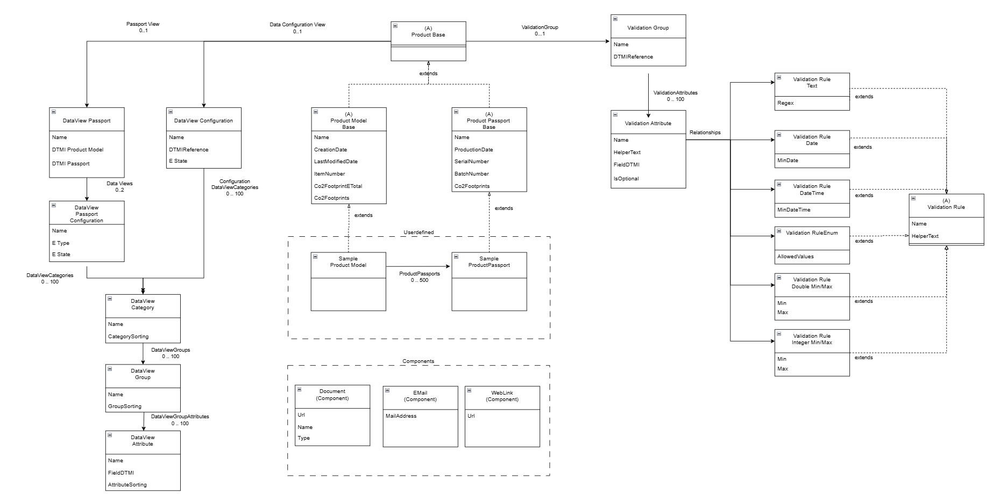

# avl-passport-dtdl 

Digital Twin Models and Sample Instances for the AVL Battery Passport. This approach should enable us to define all kind of Product Passports in a generic manner. So AVL can customize the Project to its likings based on the [DTDL V4](https://github.com/Azure/opendigitaltwins-dtdl/blob/master/DTDL/v4/DTDL.v4.md).

DTDL allows us to describe Physical Things in a machine readable manner and would leverage our Solution to be generic.

Those Models in this repository might be used as the Standard Components as a Bootstrap but this is also point of a discussion.

## Disclaimer

This Repository is still heavily in progress, this is just an outlook how the Digital Twin Models could look like and is still subject to change.

## Subjects to Change

Currently some aspects are still under validation in regard of the Graph Database queries and performance.

- Validation Models might be stored as a SQL Table to ease up following requirements
  - Auto apply to all newly created Product Models and Product Passports
  - Providing a standard group of rules based on the DTMI
  - Generally speaking the Graph Traversal might be an Issue here

# Examples

Examples contains a subset of the current Twin models as instance with random generated values for their fields.
Also the Graph is just a subset of the real Graph displaying a Product Model and the assignment of the UI and Validation Rules

# Diagram

Simplified overview

