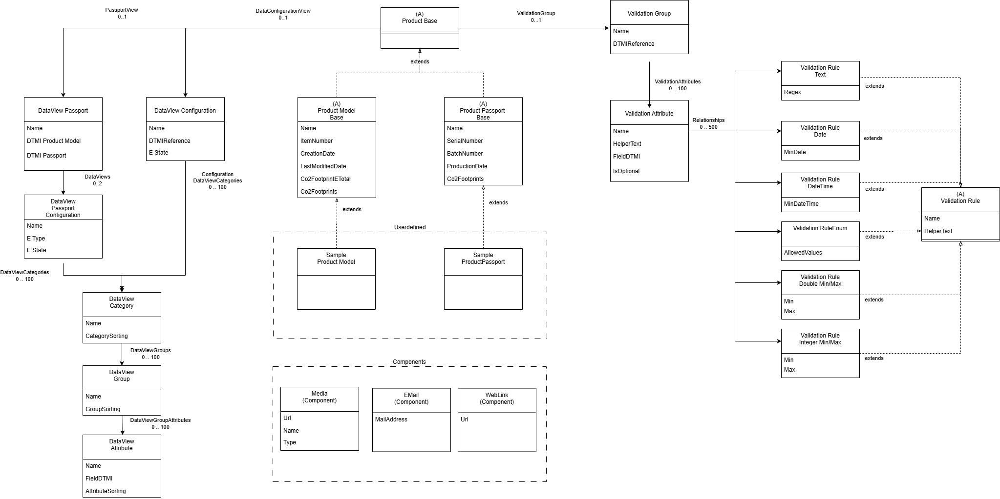

# avl-passport-dtdl 
This project is not open source. No part of it may be copied, modified, or used for commercial purposes without prior written consent.

Digital Twin Models and Sample Instances for the AVL Battery Passport. This approach should enable us to define all kind of Product Passports in a generic manner. So AVL can customize the Project to its likings based on the [DTDL V4](https://github.com/Azure/opendigitaltwins-dtdl/blob/master/DTDL/v4/DTDL.v4.md).

DTDL allows us to describe Physical Things in a machine readable manner and would leverage our Solution to be generic.

Those Models in this repository might be used as the Standard Components as a Bootstrap but this is also point of a discussion.

# Examples

Examples contains a subset of the current Twin models as instance with random generated values for their fields.
Also the Graph is just a subset of the real Graph displaying a Product Model and the assignment of the UI and Validation Rules

# Diagram

Simplified overview

